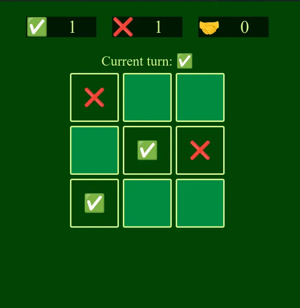

 

  

  <h3 align="center">Tic-Tac-Toe</h3>

  

    Made this basic game while playing around with Typescript and Classes and interface
     
  

## About The Project

### Built With

-   Typescript
-   CSS
-   HTML

### How to run

-   clone the repo to the local repo
-   run `pnpm install` install all the dependencies
-   run `pnpm run dev` to spin dev server
